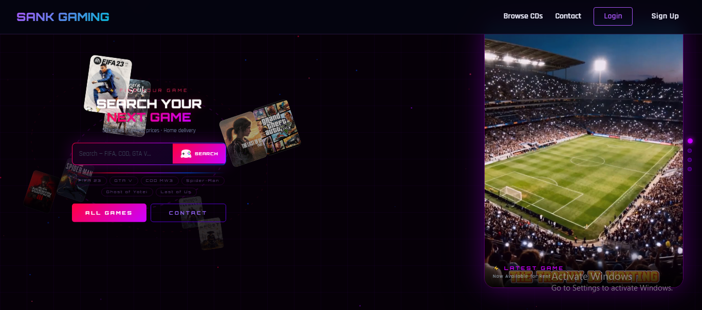
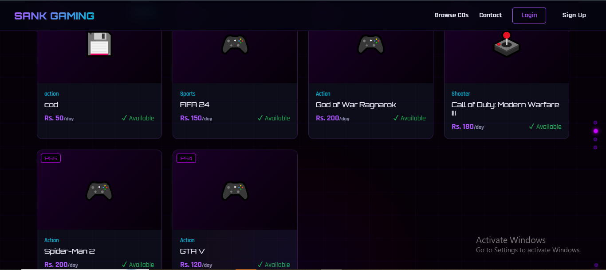
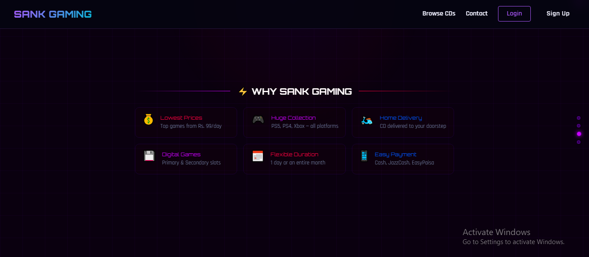
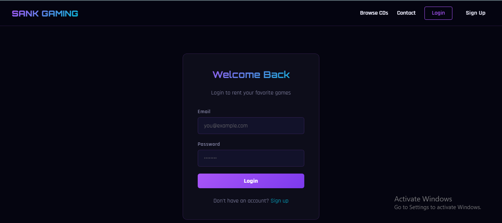
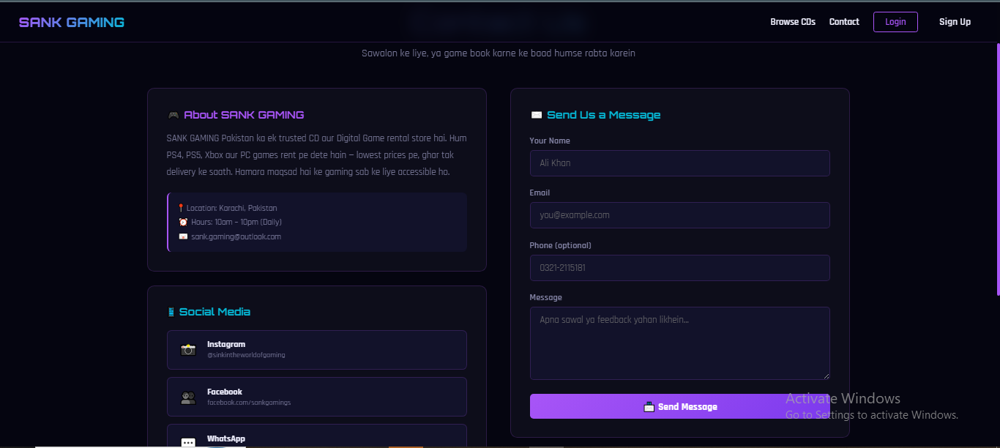

# 🎮 SANK GAMING — Premium Disc Rental Platform

**Karachi ka sabse sank disc hub.** PS5 · PS4 · Xbox · Blu-ray games ek jagah — rent karo, khelo, jita!

A full-stack CD/game rental web application where users can browse available game discs, rent them for a custom duration, and get automatic payment calculation. Admins manage everything through a dedicated dashboard with a rental calendar.

---

## 🖥️ Tech Stack

| Layer      | Technology |
|------------|------------|
| Frontend   | React      |
| Backend    | PHP        |
| Database   | SQL        |

---

## ✨ Features

### 👤 User Side
- **Sign Up / Login** — secure user authentication
- **Browse CDs** — search and filter games by name, platform (PS5, PS4, Xbox), genre (Action, Sports, Shooter, RPG, FPS)
- **Rent a Game** — select rental duration (1 day to a full month)
- **Automatic Payment Calculation** — total cost auto-calculated based on price/day × number of rental days
- **Multiple Payment Methods** — Cash, JazzCash, EasyPaisa
- **Home Delivery** — CD delivered to the user's doorstep
- **Contact Page** — send messages/feedback directly, with social media links (Instagram, Facebook, WhatsApp)

### 🛠️ Admin Side
- **Admin Dashboard** — complete overview of all users and their rental info
- **Rental Calendar** — visually marks which CD is unavailable and until what date
- **Payment Status Tracking** — admin manually marks a rental as *"Payment Received"* once payment is confirmed
- **Return Tracking** — admin marks a CD as *"Returned"* once the user returns it, automatically freeing it up for the next rental
- **User Info Management** — all user details and rental history stored and accessible

---

## 📸 Screenshots

### Homepage


### Search Your Next Game


### Browse CDs / Game Listings


### Why Sank Gaming


### Login Page


### Contact Page


---

## 🚀 How It Works

1. **User signs up / logs in**
2. **Browses available CDs** by platform, genre, or search
3. **Selects a game** and chooses rental duration (days/weeks/month)
4. System **auto-calculates total payment** based on daily rate × duration
5. User completes payment (Cash / JazzCash / EasyPaisa)
6. **Admin verifies payment** and marks it as *"Payment Received"* in the dashboard
7. CD gets marked **unavailable** on the rental calendar until the return date
8. Once the user returns the disc, admin marks it as **"Returned"**
9. CD becomes **available again** for the next customer

---

## 📂 Project Info

- **Frontend:** React
- **Backend:** PHP
- **Database:** SQL
- **Location:** Karachi, Pakistan
- **Hours:** 10am – 10pm (Daily)
- **Contact:** sank.gaming@outlook.com

### Social Media
- 📸 Instagram: [@sinkintheworldofgaming](https://instagram.com/sinkintheworldofgaming)
- 👥 Facebook: [facebook.com/sankgamings](https://facebook.com/sankgamings)
- 💬 WhatsApp: Available on Contact page

---

## 🔧 Setup / Installation

```bash
# Clone the repository
git clone https://github.com/WAJAHAT-ANSARI2/sank-gaming.git

# Navigate to project folder
cd sank-gaming

# Install frontend dependencies
npm install

# Start React frontend
npm start

# Set up PHP backend (place backend folder in your local server e.g. XAMPP/WAMP)
# Import the provided SQL file into your MySQL database

# Configure your database credentials in the backend config file
```

---

## 📌 Why Sank Gaming?

| Feature            | Description                          |
|---------------------|---------------------------------------|
| 💰 Lowest Prices     | Top games starting from Rs. 99/day   |
| 🎮 Huge Collection   | PS5, PS4, Xbox — all platforms       |
| 🛵 Home Delivery     | CD delivered to your doorstep        |
| 💾 Digital Games     | Primary & Secondary slots            |
| 📅 Flexible Duration | 1 day or an entire month             |
| 📱 Easy Payment      | Cash, JazzCash, EasyPaisa            |

---

## 👨‍💻 Author

**Wajahat Ansari**
GitHub: [@WAJAHAT-ANSARI2](https://github.com/WAJAHAT-ANSARI2)
